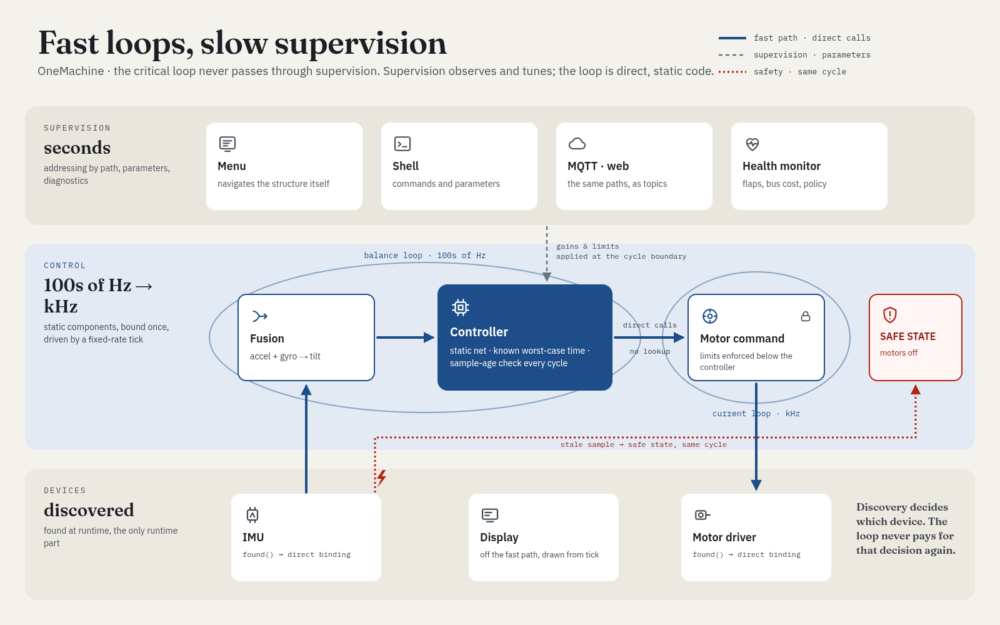

# OneMachine

Runtime device discovery, failure handling, ROS-shaped composition, typed state and roles for [HAPI](https://github.com/InternetOfPins/HAPI):
scan a bus once, get a compile-time-composed table of rows back — one indirect call in `pump()`, no per-device virtual
dispatch, no dynamic allocation. Failure edges (retry, recover, reprobe) and a health monitor (flap rate, bus cost,
quarantine, disconnect) compose over those rows the same way, at zero cost when not chosen.

Part of the [InternetOfPins](https://github.com/InternetOfPins) project family. Built on
[HAPI](https://github.com/InternetOfPins/HAPI) (the composition core) and [OneBus](https://github.com/InternetOfPins/OneBus)
(the I2C master a real scan talks over).



*An illustrative application, not shipped code: discovery finds devices once at boot (the only runtime part), a fast
static loop binds directly to them, and supervision -- a menu, a shell, MQTT, the health monitor -- only ever
touches parameters at the cycle boundary, never the loop itself. `discover::`, `fail::`, `rosCompose::` and `state::` are what
this repo actually ships; the fusion/control loop pictured is the shape they're for.*

## Why

A runtime bus (I2C, mostly) can hold a device set nobody knows until the board boots: which sensor, on which mux
channel, at which address. That's inherently a runtime fact. What doesn't have to be runtime is everything after it —
which fan-out a sample reaches, which failure policy a device gets, how a health monitor is wired in. OneMachine scans
once into a small fixed-capacity table, then dispatches through it with exactly one indirect call per poll
(`World::pump()`); everything else — the entry matching, the failure layers, the capability fan-out — is ordinary
static composition, provably free when unused ([temp.alias], the same guarantee HAPI's own `Chain`/`Part` core rests on).

Measured, not just argued (an ATmega328P, `avr-g++ -Os`, real builds in `examples/`, checked by `test/`'s own
baselines on every change):

| Adding...                          | Flash    | RAM      |
|-------------------------------------|----------|----------|
| a failure edge (`DevEdge`+`BusEdge`) | +2848 B  | +49 B    |
| a health monitor (`HealthT`)         | +1532 B  | +110 B   |

Indirect calls, counted on the compiled image, not assumed: exactly one, inside `pump()` itself (`IDriver::poll()`'s
dispatch to the row's real driver). The only other indirect jumps in a full Arduino firmware are the framework's own
-- `Print::write`'s virtual dispatch and avr-libc's `__tablejump2__` -- neither reachable from OneMachine's code.

"Zero cost when not chosen" is the same claim `test/`'s NEG_* mutation tests and `test/baselines/` check on every
change, not just here: every optional layer, trait, and unaccepted capability compiles to nothing when absent,
verified by comparing sections and symbol sets, not by inspection.

## Discovery: `discover::`

An app lists **entries** — a bare driver, or one of three wrappers — and gets a `World<>` that scans a bus into rows:

```cpp
#include <oneMachine/discover/registry.h>
#include <oneMachine/discover/identify.h>

using namespace discover;

// Use<Probe, Driver>: a row for Driver at the addresses Probe accepts. Use<Own, D> is the common case: D's own
// addrLo..addrHi, its idReg (0 if it declares none) checked against D::id, in two stages (an ACK, then the register).
using Entries = Chain<Use<Own, Mpu6050<App>>>;

struct App : World<App, Twi, Chain<MyConsumer>, Entries, /*rows*/ 4, I2cScan> { ... };

App::discover();   // scans 0x08..0x77 once; App::reg now holds the real topology
App::pump();       // one poll per alive row, one indirect call total
```

- `Ignore<Lo,Hi>` claims a range with no row — an address the app never wants to see. `IgnoreBridge<Bridge>` is the
  variant for a *real* mux the app doesn't use: it clears the bridge once claimed, so a channel selection left over
  from before this boot can't leak devices behind it onto the parent bus.
- `Protect<Lo,Hi>` is a rule, not an entry: no entry that writes to the device may cover the range (a compile error
  if one does).
- A driver's `Produces` (a `Chain` of capability tags) decides whether `pump()` calls its `read()` at all; a driver
  that produces nothing (a display) opts in with `static constexpr bool polled = true`.
- A capability fan-out is a plain static consumer list: a driver `emit`s a `Sample<Cap>`, every consumer whose
  `Accepts` names `Cap` gets it, at compile time.

## Failure handling: `fail::`

A driver that also derives from `DevEdge<Impl, W, Mode, K>` gets a failure controller: `Mode` picks the layers
(`Retry`, `Recover`, `Reprobe`, `Backoff`, `Gate`, ...), composed the same way HAPI composes anything else — the
layer list *is* the policy, nothing to configure at runtime.

```cpp
#include <oneMachine/fail/busedge.h>
#include <oneMachine/fail/devedge.h>

using namespace fail;

struct Mode {
  using Twi = MyTwi;
  static constexpr bool checked = true, returnPath = false, idempotent = true, lifecycle = true;
  template<typename E> using BusStack = Controller<E, TickPart<Retry<0>>, Recover, DetectError, HoldOp<Coalesce>, Backoff<100, 400>, Status>;
  template<typename E> using DevStack = Controller<E, TickPart<Retry<2>>, Recover, DetectError, HoldOp<Coalesce>, Gate<50>, TickPart<Reprobe<500, 120>>, LazyStatus>;
};

struct MyDriver : DriverBase<MyDriver<App>, App>, DevEdge<MyDriver<App>, App, Mode, 1> { ... };
```

A bus-level fault (a timeout, an arbitration loss) is attributed to the *bus* row, not the device: "a bus that returns
touches nothing" — a device that comes back with its bus is left alone; a device that came back **on its own** is
re-initialised (it may have lost state). A driver that wants a say in a bus's own return declares `recheck(row)` (force
its own check now) or `reinitOnBusReturn = true` (its init is safe to repeat) — optional, zero cost if not declared.

## Health monitoring: `fail::HealthT`

One monitor, composed once, watches every row's own status changes (never a bus fault following through to its
devices — that attribution is reused, not re-derived) and applies a policy: **Report** always; **Quarantine** a row
that flaps past a threshold (`pump()` and the failure edge's own ticking both stop touching it, a growing — Fibonacci
— block, then a trickle of probes to test recovery); **Disconnect** one that costs too much bus time (calls the
driver's own `isolate(row)`); **Escalate** instead, for a `required` row, to an app-declared hook.

```cpp
#include <oneMachine/fail/health.h>

struct App : World<...>, BusEdge<...> {
  using Health = HealthT<App, Drivers, /*rows*/ 4>;
  static void onEscalate(RowId row, EscalateReason) { /* a required row's condition, routed onward */ }
};

// in the app's own loop:
App::Health::onEdge();     // every tick: catches a flap that starts and clears inside one control period
App::Health::onTick(now);  // the monitor's own, coarser period: decay, cost sampling, policy
```

A driver opts a row in to isolation with `static constexpr bool mayIsolate = true;` and `static void isolate(RowId)`
(cut its own supply, disable its channel — whatever "off" means for that device); `static constexpr bool required = true;`
means it is never quarantined or disconnected, only escalated. Neither declaration costs anything when absent.

## ROS-shaped composition: `rosCompose::`

The same discovered rows can feed a pub/sub, request/response, and long-running-goal shape that mirrors `rclcpp`'s
own structure (a service is two correlated topic hops; an action is three services, two topics, and a pure
state-transition function over `rcl_action`'s own goal states) — without a DDS stack, a middleware thread, or
`std::function` anywhere.

```cpp
#include <oneMachine/rosCompose/transport.h>

using namespace rosCompose;

// a local, compile-time fan-out: every subscriber's on(msg) runs, no vtable, no container
struct LogIt { template<typename T> struct Part : T { void on(const Odom& m) { Serial.println(m.x); } }; };
using Topic = LocalFanout<Odom, Subscriber<Odom, LogIt>>;
```

Everything crossing a real process boundary — another node, discovered at runtime, reached over a network hop —
goes through one seam, `Cap<Msg>`: the only virtual call in the whole module, same shape as `discover::`'s own one
indirect call per poll. `qos.h`'s `WithHistory`/`WithDeadline` fold onto a `Subscriber` the same way any HAPI
decorator does; `service.h`'s `Client`/`Service` correlate a request/response pair over a fixed-capacity table (no
heap); `action.h`'s `ActionServer` tracks goals through `GoalState`/`GoalEvent` the same way.

## Typed state: `state::`

One object holds the state of a composition, one named struct per layer, and the layers are addressed by tag, not by index.
The step, the wire frame, the self-description and a schema hash all come from the same layer list:

```cpp
#include <oneMachine/state/state.h>
#include <oneMachine/state/wire.h>

struct Count { ONEMACHINE_STATE_NAME(name, "count"); };        // a layer's identity; the text is in flash on AVR
struct Peak  { ONEMACHINE_STATE_NAME(name, "peak"); };

struct CountSlot { uint16_t n; ONEMACHINE_STATE_NAME(n_n, "n");                       // fixed-width fields, one `each` naming them
  template<class Self, class F> static constexpr void each(Self& s, F& f) { f(n_n(), s.n); } };
struct PeakSlot  { uint16_t max; ONEMACHINE_STATE_NAME(n_max, "max");
  template<class Self, class F> static constexpr void each(Self& s, F& f) { f(n_max(), s.max); } };

struct CountStep { template<class Below, class Prev> static CountSlot run(const Below&, const Prev& prev)
  { return {uint16_t(state::get<Count>(prev).n + 1)}; } };
struct PeakStep  { template<class Below, class Prev> static PeakSlot run(const Below& below, const Prev& prev)
  { uint16_t n = state::get<Count>(below).n, m = state::get<Peak>(prev).max; return {n > m ? n : m}; } };

// the last layer listed runs first: Peak reads the new Count from `below`, its own old value from `prev`
using State = hapi::APIOf<state::API, state::Layer<Peak,PeakSlot,PeakStep>, state::Layer<Count,CountSlot,CountStep>>::Res;
ONEMACHINE_STATE_PIN(State, 0xe78c2bdfu);        // the schema as this target compiles it; a plain `int` that is 16 bits here and 32 there fails this build

State prev{}, next{};
next.step(prev);                                 // `next` is written layer by layer; a layer without a step holds its value
uint8_t frame[state::wire_size<State>()];
state::write(next, frame);                       // hash, then every field, little-endian at its declared width
State peer{};
state::read(peer, frame, sizeof frame);          // Ok, or BadHash / BadLength / BadValue with `peer` untouched
```

- `hapi/slots.h` (HAPI 0.8.0) is the storage; this module adds the names, the step, the hash and the wire.
- `state::schema_v<R>` is a 32-bit FNV-1a over layer names, field names and field types, in chain order, at compile time.
  A frame starts with it, so a peer refuses a frame of another schema instead of misreading it.
- [`face.h`](include/oneMachine/state/face.h): `state::describe<R>(put)` prints what a peer needs to read a frame (and to
  recompute its hash), `state::json(res, put)` prints the state. These are the only readers of the names; a program that
  calls neither has no names in its flash image.
- Field types: `bool`, 8 to 64-bit integers, and fixed-size arrays of those. Not `char`, not floating point, and the
  widths are the ones you wrote (`int16_t`, not `int`).
- Unique layer names, unique field names in a layer and at most `ONEMACHINE_STATE_MAX_NAMES` (32) of each are compile errors.
- Unused, it costs nothing: a typed state and the hand-indexed byte array it replaces are the same flashed image
  (`test/state/build.sh` compares them on an ATmega328P). The frame an AVR writes is byte-equal to the host's, and to one a
  Python implementation builds from the description alone.

## Roles: `role::`

What an output is for, declared by the machine: `role::Role<Tag, Kind, Endpoint>` names it ("white"), gives its kind
(`Light<4000>`) and says where it is, known only to the device. A consumer uses role names and nothing else; the device binds
each role when discovery finds its device (`role::Found`, by driver type, address and `discover::Behind`) and routes every
request itself. `role::Link` carries the descriptions and the command and report frames over any byte stream, and
[`python/onemachine`](python/onemachine) is the consumer side: `m.cmd.white.level = 3000; m.push()`.
`role::Call` gives the same protocol a C ABI (`onemachine_call`) for a consumer in the same process, such as Python through ctypes or Rust
over FFI. Rewired firmware with the same
roles needs nothing from the consumer; a role that is gone is reported, never retargeted. See [`docs/role.md`](docs/role.md);
`test/role/build.sh` checks it natively, from Python across four firmware variants, and measures it on an ATmega328P.

## Examples

Four stages, each adding one thing to the last, all built around one real sensor (a GY-521/MPU6050 on a Nano):

- [`examples/discover`](examples/discover) — find the device by its own identity, print the table.
- [`examples/mpu6050`](examples/mpu6050) — read its real capabilities, print them as they arrive.
- [`examples/recover`](examples/recover) — a failure edge: transient faults retried, re-probed, re-initialised.
- [`examples/health`](examples/health) — a health monitor: correct fault attribution and flap tracking by hand;
  quarantine and disconnect themselves are proven by the test suite, not the hand demo (see its own README).

And one on the output side, needing only a Nano:

- [`examples/python`](examples/python) — outputs driven by role name from Python over USB serial, or on the host with the
  pins simulated: the consumer side of `role::`.

`test/examples/build.sh` builds all five for the Nano on every change, so they can't silently rot as the library
evolves.

## Status

Proven on real hardware (an ATmega328P, a real I2C bus, a real GY-521/MPU6050), in the shipped examples themselves:
discovery, and the failure edges' recover/reprobe/re-init paths, including a device coming back through recovery on
its own. The health monitor's full report → quarantine → disconnect sequence is proven by the test suite
(`test/fail/build_f7.sh`, mutation-tested, simavr-verified), not by the hand demo; `examples/health` itself
hardware-verifies the piece a hand test can actually reach -- correct fault attribution and flap tracking. Native
and AVR builds are both part of every check this library carries forward from its own development.

## License

MIT.
